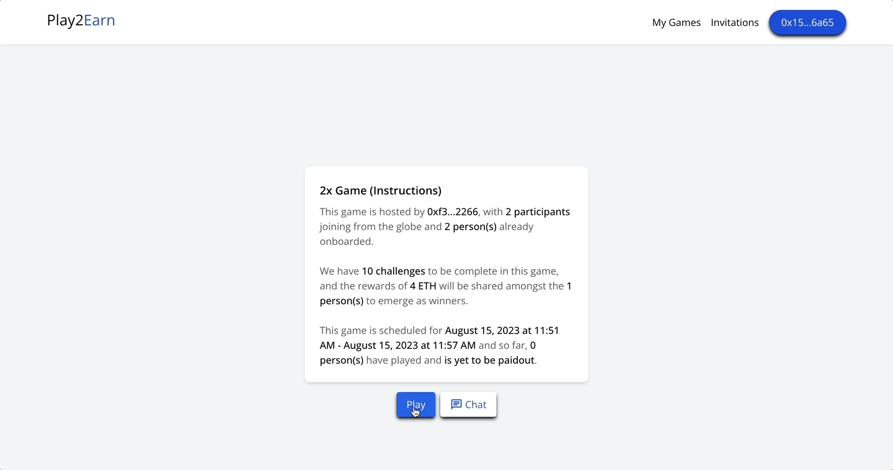
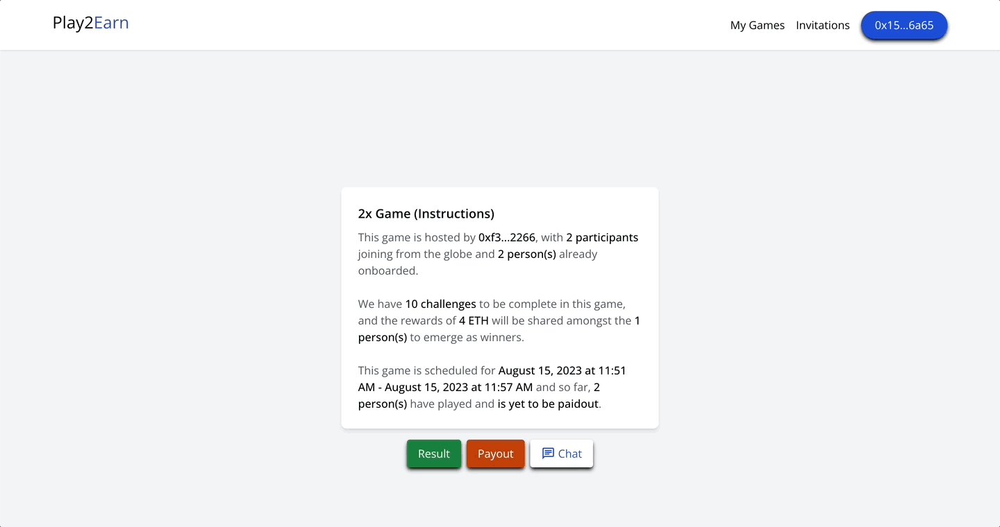
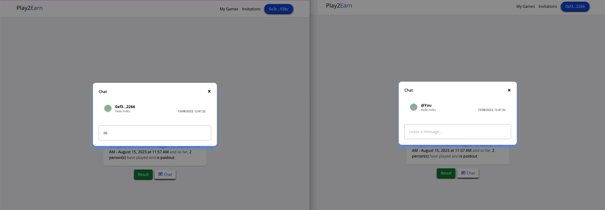

# Build a Decentralized Voting Dapp with Next.js, TypeScript, Tailwind CSS, and CometChat

Read the full tutorial here: [**>> Build a Decentralized Voting Dapp with Next.js, TypeScript, Tailwind CSS, and CometChat**]

This example shows How to Build a Decentralized Voting Dapp with Next.js, TypeScript, Tailwind CSS, and CometChat:

<figcaption>Placing Bids</figcaption>

<figcaption>Paying out</figcaption>

<figcaption>One-on-One Chat</figcaption>

## Technology

This demo uses:

- Metamask
- Hardhat
- Infuria
- ReactJs
- Tailwind CSS
- Solidity
- EthersJs
- Faucet

## Useful links

- 🏠 [Website](https://dappmentors.org/)
- ⚽ [Metamask](https://metamask.io/)
- 🚀 [CometChat](https://try.cometchat.com/oj0s7hrm5v78)
- 💡 [Hardhat](https://hardhat.org/)
- 📈 [Infuria](https://infura.io/)
- 🔥 [ReactJs](https://reactjs.org/)
- 🐻 [Solidity](https://soliditylang.org/)
- 👀 [EthersJs](https://docs.ethers.io/v5/)
- 🎅 [Faucet](https://www.alchemy.com/faucets)
- ✨ [Live Demo](https://dappworks.vercel.app/)
